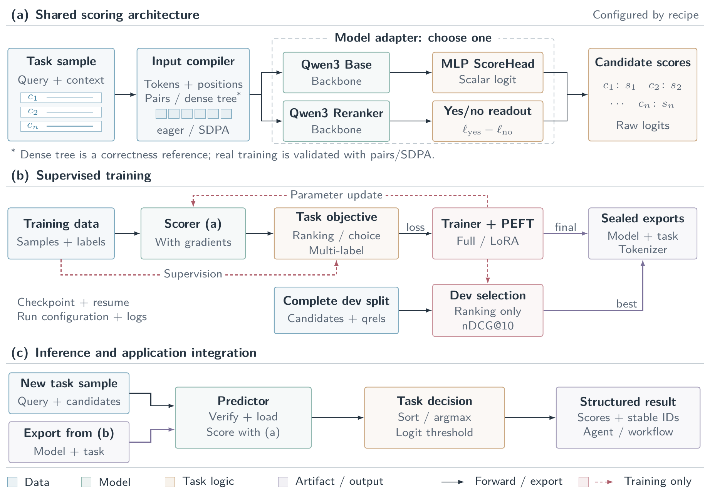
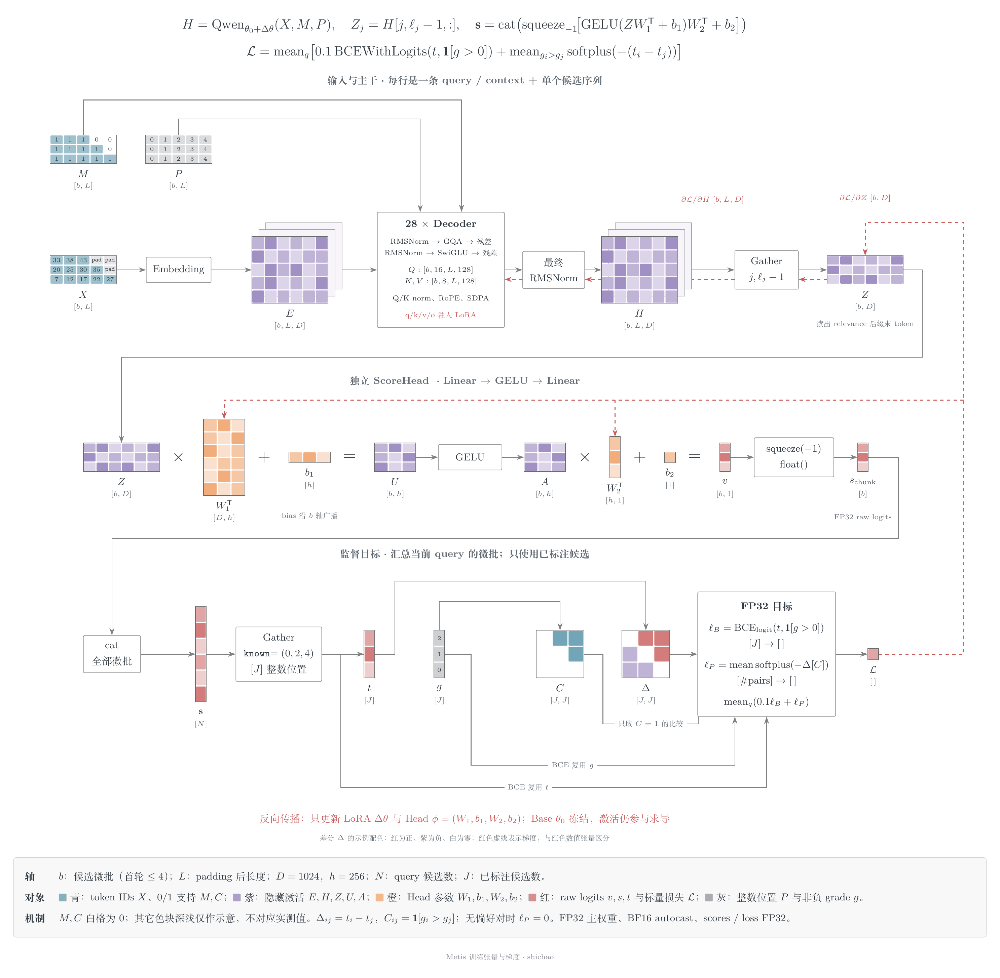
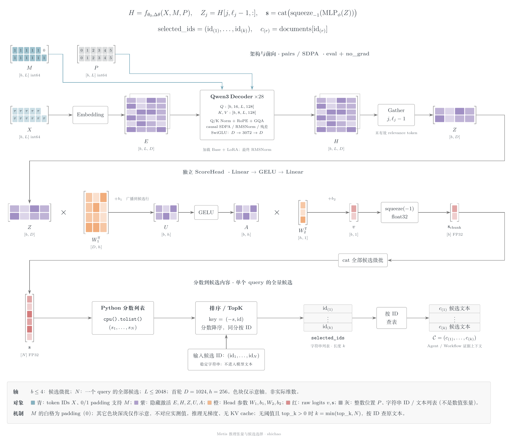

# Metis · 墨提斯

**English** | [简体中文](README.zh-CN.md)

Metis is a task-specific post-training toolkit: train models that take queries, context and candidates, then return scores and candidate IDs for agents and applications.

- Fine-tune Qwen3 Base with an independent ScoreHead using LoRA or full fine-tuning. A separate Qwen3 Reranker adapter supports yes/no readout.
- Track data versions, select checkpoints on validation data, and export models with integrity checks.
- Load exported models through `Predictor` for ranking, single-choice or multi-label candidate selection.

The architecture baseline is **v1.0**. Complete evaluation, candidate sampling and dev-set checkpoint selection currently support ranking only. Real training has been validated with pairs/SDPA; dense tree is a correctness reference. RL, multi-GPU training and sparse backends are not implemented.

## Architecture

Data preparation, input compilation, model readout, training and inference share the same candidate IDs and input contract.



[Full-size PNG](docs/architecture/figures/metis-architecture-en.png) · [PDF](docs/architecture/figures/metis-architecture-en.pdf) · [Architecture guide](docs/architecture/framework.md)

## Quick start

Python 3.10 or newer is required.

```bash
git clone https://github.com/Shichaoxx/Metis.git
cd Metis
python -m venv .venv
source .venv/bin/activate
python -m pip install -e ".[train,peft]"
metis --help
```

After training and exporting a model:

```python
from metis import Predictor

predictor = Predictor("path/to/run/exports/best")
results = predictor.predict(samples, top_k=5)
```

See the [usage guide](docs/usage/getting-started.md) for the `samples` format and the [NFCorpus cookbook](cookbooks/score-head-plan.md) for training. Model weights and datasets are downloaded separately.

## Tensor walkthroughs

These diagrams follow the first Qwen3-0.6B-Base + ScoreHead + LoRA recipe, showing tensor shapes, operations and color legends. Labels are in Chinese; the [model guide](docs/architecture/score-head.md) explains the notation.

### Training

Candidate batches pass through the backbone and ScoreHead. Query-level losses update LoRA and head parameters while the base weights remain frozen.



[Full-size PNG](docs/architecture/figures/metis-tensor-training.png) · [PDF](docs/architecture/figures/metis-tensor-training.pdf)

### Inference

The exported model scores candidates without gradients. Scores are mapped back to candidate IDs, ranked and selected for downstream use.



[Full-size PNG](docs/architecture/figures/metis-tensor-inference.png) · [PDF](docs/architecture/figures/metis-tensor-inference.pdf)

## NFCorpus results

The first cookbook covers two training epochs, model selection on the complete dev set, one test evaluation of the selected model, export/reload and a workflow that assembles evidence from ranked documents.

| Model | Test nDCG@10 |
|---|---:|
| Qwen3-Reranker-0.6B | 0.3548 |
| Qwen3-0.6B-Base + ScoreHead + LoRA | 0.2910 |

The ScoreHead configuration scored below the original reranker. The models differ in readout, input templates and training history, so this is a comparison of complete methods, not an ablation. See the [evaluation protocol](cookbooks/score-head-plan.md) for data and measurement details.

## Documentation

Most detailed documentation is currently in Chinese.

- [Documentation index](docs/README.md)
- [Implementation status](docs/project/status.md)
- [Examples](examples/README.md)
- [Contributing](CONTRIBUTING.md)

## Author and license

Created by [shichao](https://github.com/Shichaoxx). This repository currently has no `LICENSE` file. Data, models and dependencies retain their respective licenses; teaching and method references are listed in [Acknowledgements](ACKNOWLEDGEMENTS.md).
