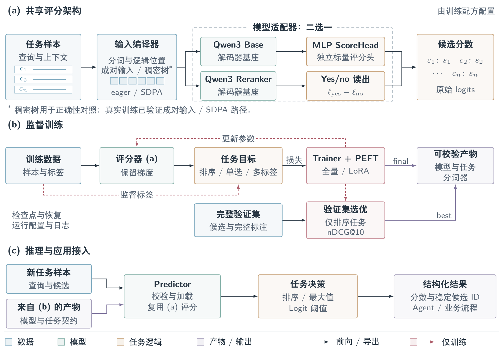

# Metis · 墨提斯

[English](README.md) · **简体中文**

**面向排序与候选选择的模型后训练工具包。** 将任务数据训练成可供 Agent 和业务流程调用的模型，返回候选分数与稳定 ID。

- **训练** — Qwen3 Base + 独立 MLP ScoreHead，支持全量微调与 LoRA；另提供 Qwen3 Reranker yes/no 适配器。
- **评测** — 排序任务支持完整验证集选优、checkpoint 恢复，以及独立的 best/final 导出。
- **调用** — 通过统一的 `Predictor` 接口完成排序、单选和多选。

架构基线为 **v1.0**。完整评测、候选采样与 dev 选优目前仅支持排序任务。真实训练已验证 pairs/SDPA；dense tree 用于正确性对照。RL、多卡训练与稀疏后端尚未实现。

## 架构

共享评分路径连接数据、模型与任务决策；监督训练和推理分别展示。



[原尺寸图片](docs/architecture/figures/metis-architecture-zh.png) · [矢量 PDF](docs/architecture/figures/metis-architecture-zh.pdf) · [架构说明](docs/architecture/framework.md)

## 快速开始

需要 Python 3.10+。从源码安装：

```bash
git clone https://github.com/Shichaoxx/Metis.git
cd Metis
python -m venv .venv
source .venv/bin/activate
python -m pip install -e ".[train,peft]"
metis --help
```

加载训练导出的模型：

```python
from metis import Predictor

predictor = Predictor("path/to/run/exports/best")
results = predictor.predict(samples, top_k=5)
```

`samples` 包含查询、可选上下文和带稳定 ID 的候选。样本格式与训练产物说明见[使用指南](docs/usage/getting-started.md)。

## 张量视角

以下两图展示首个 Qwen3-0.6B-Base + ScoreHead + LoRA 配方中的张量形状、读出与数据流。颜色、轴和符号说明位于各图底部。

### 训练

候选输入经过 Qwen 与 ScoreHead 得到分数，监督损失反向更新 LoRA 和评分头。


[原尺寸图片](docs/architecture/figures/metis-tensor-training.png) · [矢量 PDF](docs/architecture/figures/metis-tensor-training.pdf)

### 推理

模型在无梯度模式下打分，经排序和 TopK 选择返回候选 ID，再由调用方提取对应内容。


[原尺寸图片](docs/architecture/figures/metis-tensor-inference.png) · [矢量 PDF](docs/architecture/figures/metis-tensor-inference.pdf) · [张量教程](docs/learning/tensors.md)

## NFCorpus 示例

首个 cookbook 已完成两轮训练、完整 dev 选优、选定 best 的 test 评测和新进程重载。

| 模型 | Test nDCG@10 |
|---|---:|
| 原始 Qwen3-Reranker-0.6B | 0.3548 |
| Qwen3-0.6B-Base + ScoreHead + LoRA | 0.2910 |

本轮训练结果低于原始 reranker。两者模板、读出和训练历史不同，属于完整方法对照；完整协议与结果见 [NFCorpus cookbook](cookbooks/score-head-plan.md)。

BoolQ 独立研究比较了[门控与残差评分头](cookbooks/boolq-readout-ablation.md)、[读出位置与注意力池化](cookbooks/boolq-readout-selection.md)。两轮均未建立超越简单基线的稳定收益，v1 架构保持不变。

## 文档

[使用指南](docs/usage/getting-started.md) · [示例](examples/README.md) · [项目状态](docs/project/status.md) · [贡献指南](CONTRIBUTING.md)

## 作者与许可

由 [shichao](https://github.com/Shichaoxx) 维护。项目尚未指定软件许可证；第三方数据、模型和依赖遵循各自条款。Tree Mask 教学参考及其他来源见[致谢](ACKNOWLEDGEMENTS.md)。
