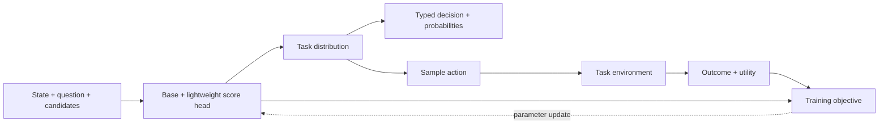

# Metis v2 设计草案

状态：**讨论稿，生产契约尚未实现；部分读出已完成独立研究**。资料核查日期：2026-10-05，实验更新：2026-10-07。v1 的模型、输入与产物契约见[核心设计](../project/core.md)；实现和真实训练范围见[项目状态](../project/status.md)。

## 1. 设计目标

v2 以统一的条件打分器组织专用任务后训练：

\[
z_i=f_{\theta,\phi}(\text{state},\text{question},\text{answer}_i).
\]

基座提供语义表示，轻量读出头产生 logits；任务定义决定 logits 的概率解释、监督目标、动作分布、评测与输出。任务专用的 head/LoRA 可以分别训练，共用同一种模型结构与工具包接口。是否共享一套任务权重属于实验选择，统一接口不要求所有任务使用同一组权重。

优先完善三项能力：类型化概率输出、可选的反馈训练、共享状态的高效执行。推理延迟、训练成本和依赖复杂度分别度量，不能以可训练参数少代替运行成本评测。

## 2. v1 目标与遗留差距

| 原定方向 | v1 状态 | v2 需要解决的问题 |
|---|---|---|
| LLM Base + 任务读出 | Qwen3 Base + 独立 MLP ScoreHead 已实现；另有 yes/no 适配器 | 保留候选打分主路径，建立读出与任务契约，逐步开放其他基座 |
| 可配置的专用任务工具包 | 三种内置任务；通用 Registry 容器和模型工厂 | Task/Objective/Evaluator/Decision 仍是固定分支，尚未形成可复用插件协议 |
| 排序、选择与分类 | ranking 完成真实训练；single_choice/multi_label 已有损失与决策 | 单选、多选缺少完整评测、dev 选优和真实 cookbook；尚无显式 Boolean/OrdinalScore 契约 |
| 共享状态与高效 attention | pairs 与 dense tree；tree 有小规模等价性验证 | 首轮训练使用 pairs/SDPA；共享前缀的真实吞吐、显存和训练质量尚未验证 |
| 可供 Agent 使用的可靠决策 | 稳定 ID、结构化分数、产物重载与证据 workflow | 没有概率校准与覆盖率/错误率评测，也没有环境反馈训练或下游任务成功率评测 |
| 专用模型的质量与轻量化 | 工程闭环完成 | NFCorpus 首轮 nDCG@10 为 0.290978，低于原始 reranker 的 0.354783；尚无受控效率消融 |

v1 保留了原定的判别式 Base + Head 路线。主要差距是实现覆盖范围与验证深度，而非转向生成式聊天训练。NFCorpus 应继续作为一个 cookbook，任务接口与框架建设需要通过第二种真实任务验证。

## 3. Jev 的公开接口与证据边界

Jev 官方的三种原语是 **Noul、Choice、Score**，不是 Boolean、Choice、Ranking 三种任务：

| 官方原语 | 语义 | Metis 的可选对应方式 |
|---|---|---|
| Noul | 一个命题为真的概率 | Boolean：单 logit 经 sigmoid，或 yes/no 两项 logits 经 softmax |
| Choice | 离散选项分布及所选选项 | 候选 logits 经 softmax，保留完整选项分布 |
| Score | 有序评分等级的分布与期望分数 | 对等级描述打分，再计算等级概率与期望 |

官方同时说明 Choice/Score 的 `confidence` 是概率分布的确定性摘要；Noul 不返回单独的 confidence。[官方原语](https://docs.typesafe.ai/introduction)、[Confidence 定义](https://docs.typesafe.ai/confidence)。

排序可以在 Metis 中作为同一打分器的另一种任务视图，但不能将 Jev 的 Score 解释为候选列表排序。Jev 的接口及并行调用行为也不能证明其内部采用某个具体 backbone、MLP、tree mask 或稀疏算子。

官方将 RLCD 定义为 **Reinforcement Learning for Calibrated Decisions**，目标是结构化决策及校准概率。核查的[发布说明](https://typesafe.ai/blog/introducing-system-one-models-and-jev)和 [AI Primer](https://docs.typesafe.ai/introduction/machine-learning-primer)没有披露可复现的奖励函数、采样算法与完整训练配方；不能据此声称复现官方训练。

需区分两项独立研究：

- [OpenJev-RLCD: A Working RLCD Implementation](https://arxiv.org/abs/2609.38850)，2026-09-30 预印本，是独立的推理模型实现。其两阶段方案先训练推理后的概率读出，再以 proper score 奖励推理采样。采样对象为文本 rationale，不是 Metis 当前的候选动作；不能直接作为低延迟非生成模型的训练配方。[作者代码固定版本](https://github.com/ZimmyGao/openjev-rlcd/tree/22db40ad3333f5cf0bc5139097da70e0f8c05018)。
- [RLCD: Reinforcement Learning from Contrastive Distillation](https://arxiv.org/abs/2307.12950)，2023 年的语言模型对齐方法，使用对比提示构造偏好数据。名称缩写相同，训练目标与 Jev 所称 calibrated decisions 不同。

## 4. 统一打分与任务视图

统一的是 logits 接口及生命周期，概率支持集与损失保留任务语义。

| 建议任务视图 | logits 到输出 | 训练及验证 |
|---|---|---|
| Boolean | `sigmoid(z)` 或二项 softmax | BCE/log score 或 Brier；AUROC、NLL、Brier、校准与拒答 |
| Choice | `softmax(z / T)`，在有效候选内归一化 | CE/soft-target CE；accuracy、NLL、Brier、risk–coverage |
| OrdinalScore | 等级分布 `p`；输出 `sum(level_value * p)` | 概率目标与有序距离目标；等级概率质量、MAE、校准 |
| Ranking | 对候选 raw scores 排序；训练采样可用 Plackett–Luce | 排序目标、nDCG/MAP；列表反馈训练需记录列表 log-probability |
| MultiLabel | 各候选独立 sigmoid | BCE；micro/macro-F1、逐标签校准 |

对于 Choice，softmax 表达的是给定候选集合内的互斥答案分布。多个工具可能同时有效时，应定义有效动作奖励或软目标，不能强行当作唯一正确分类。候选集不完整时，需要明确“无适合选项”、拒答和零召回的处理。

对于 OrdinalScore，等级数值和等级概率分别保存；期望分数相同的两种分布可能具有不同不确定性。可以以等级候选打分开始，不必新增大型任务头；是否增加 ordinal 专用损失需受控验证。

对于 Ranking，分数顺序不提供“排序正确的概率”。softmax 分布表示选择分布，不能自动解释为每篇文档独立相关的概率。

输出建议明确区分：`raw_scores`、`probabilities`、`probability_semantics`、`decision`、`uncertainty`、`calibration`。分布集中程度与经验正确率分别报告。confidence 可以由概率计算，不需要默认新增 confidence head；若要声称“0.9 约对应 90% 正确”，必须有任务内的校准证据。

## 5. RL 接入与概率学习

### 5.1 概率质量与行动收益

优化选择成功率，并不自动优化概率校准。若真实答案分布为 `q`，按报告的 `p` 采样答案、正确得奖励 1，则期望收益是 `p · q`；其最优策略集中在最可能的答案上，不要求 `p = q`。

严格 proper scoring rule 的最优报告则是真实条件分布。例如多分类 Brier loss 为：

\[
\mathcal L_{\mathrm{Brier}}=\sum_i(p_i-\mathbf1[Y=i])^2.
\]

理论参考：[Gneiting & Raftery, Strictly Proper Scoring Rules](https://sites.stat.washington.edu/raftery/Research/PDF/Gneiting2007jasa.pdf)。在完整标签可用且概率输出可微时，CE/Brier 可以直接训练；仅将损失改名为 reward 不构成新的 RL 流程。proper score 的总体最优性质也不保证有限数据、有限模型或分布迁移下自然校准。

v2 建议分别管理：

1. **预测分布**：报告答案、等级或事件概率；通过监督或 outcome 标签学习，并独立校准。
2. **行动策略**：根据预测、动作成本与有效性约束选择或采样动作；通过结果反馈优化。

两者可共享同一打分器，但应保留独立语义和配置。行动采样温度、探索策略和部署决策均需记录。

### 5.2 最小反馈训练流程

先支持单步有限动作任务，即 contextual bandit。沿用当前可微 `score_tensors()`，建立 Categorical 策略：

\[
\pi_\theta(a\mid x,C)=\operatorname{softmax}(z/T)_a,
\qquad
\mathcal L_{\mathrm{PG}}=-(r-b)\log\pi_\theta(a\mid x,C).
\]

反馈训练更新 head 与 LoRA；历史均值等不依赖当前动作的 baseline 可以降低方差，初版无需新增 critic/value head。完整动作收益可枚举时，优先计算精确期望；仅所选动作产生反馈时，使用对应的策略梯度或 bandit 方法。

图为拟议的 v2 接入关系，非已有执行路径。需要新增的最小契约：

| 契约 | 必须记录或提供的内容 |
|---|---|
| TaskSpec | 输入、答案支持集、概率语义、有效性约束、指标、监督或反馈类型 |
| Policy | 采样及动作 log-probability、温度、有效候选 mask、部署决策 |
| Experience | 输入与候选身份、行为模型/策略版本、动作、行为概率、奖励、终止及失败状态 |
| Reward/Environment | 成功定义、质量和成本、结果反馈；单步或多步模式 |
| Objective | 监督、proper score、策略梯度及可选参考 KL；组合权重显式配置 |
| Artifact | 模型/编译器/任务/策略/校准身份及可恢复训练状态 |

当前 `Predictor` 的 no-grad 浮点输出用于部署或采集，训练重新调用可微评分器。采样与重算必须匹配输入、候选支持集、温度与 dropout 行为；旧监督 checkpoint 不是 RL 中途恢复点。

动作执行成功率是 `P(success | state, action)`，与“哪个动作应被选中”的分类分布不同。仅观察所选动作的结果时，不能凭空补全其他动作的标签或声称获得完整分布的 Brier 监督。离线训练需要评估日志策略概率、探索覆盖及反馈偏差。

Ranking 的 RL 目标可参考 [Neural PG-RANK](https://arxiv.org/abs/2310.04407)：无放回采样排序列表，并计算整个列表的 log-probability。多步任务另外需要状态转移、回报归因和轨迹契约。

## 6. 轻量化架构选项

| 优先级 | 选项 | 预期收益与验证边界 |
|---|---|---|
| 1 | 保持小型 scalar head，先补任务与校准契约 | 复用现有计算图；避免为不同输出重复建设整套训练器 |
| 2 | 动态长度 batching、候选分桶和实际 token 预算 | 减少 padding 和极长候选造成的开销；核验 ID 对齐、截断和质量 |
| 3 | 共享 state/prefix 的推理执行 | 减少公共前缀重复计算；需要每层 KV 复用、正确逻辑位置及 adapter/version 身份 |
| 4 | 任务蒸馏到更小的 base/encoder | 直接降低主干成本；以教师分数/软概率及任务标签训练，重新验证校准与泛化 |
| 5 | 多问题共享 state，一次返回多个任务结果 | 作为 v2 编译器与执行扩展；问题分支保持隔离，状态置前的模板变更需要重新验证 |
| 条件触发 | 候选集合交互、小型 SetTransformer | 适用于组合约束、去重或互斥关系确实影响质量的任务；会改变候选独立评分语义 |

LoRA 减少可训练参数与优化器状态，但前向仍执行基座。首轮 2,556,417 个可训练参数不意味着整个模型只有该规模。缩小 head 通常不能解决主干与前缀重复计算的开销。

门控与标量残差读出属于 v2 候选结构；[BoolQ 消融](../../cookbooks/boolq-readout-ablation.md)分别进行冻结表示与联合 LoRA 验证，尚未支持稳定质量收益。

[第二轮读出研究](../../cookbooks/boolq-readout-selection.md)固定 MLP，在 1,536 train / 192 dev / 384 新预留 evaluation 上比较两个末尾文本标记与候选正文注意力池化，每种使用三个种子。按平均选定 dev NLL，原 Relevance 读出仍为候选；九组 evaluation 均预测正类，accuracy 58.33%、balanced accuracy 50%。另两种读出相对原方案的 NLL/Brier 差值区间包含零。该预算下，增加池化没有建立任务质量收益；相同决策不表示架构等价。

研究代码和保存格式均独立于 v1 默认模型。Decision 标记使用现有词表，不是新增可学习 token；层内注入和其他任务仍未验证。后续架构比较应先建立有效的监督基线、固定任务预算和校准协议，再以质量及运行成本决定是否增加结构。

共享前缀的推理研究参考 [Hydragen](https://arxiv.org/abs/2402.05099)。设公共前缀长度为 `P`、每个分支长度为 `C`、候选数为 `N`，简化 attention 工作量由 pairs 的约 `N(P+C)^2` 降为目标稀疏结构的约 `P^2 + N(PC+C^2)`。当前 dense tree 物理长度约为 `P+NC`，不能仅凭 mask 推断具备该工作量或吞吐收益；投影、MLP、缓存读写与 kernel 启动成本仍需计入。

训练共享前缀时，启用 LoRA 的前缀表示仍需梯度，不能用 detached KV cache 替代共享反向图。推理、训练后端分别建设和验证；position IDs、padding、GQA、dtype、dropout 与读出必须对应参考实现。

蒸馏的已有研究可参考 [DistilBERT](https://arxiv.org/abs/1910.01108)，但 Metis 的模型选择需在同一任务与硬件上重测，不能套用其速度数字。量化可作为后续部署选项，校准分布与拒答阈值应在量化模型上重新验证。

## 7. 建议开发顺序与验收

1. **统一任务契约。** 定义 Boolean/Choice/OrdinalScore 视图，保留 Ranking/MultiLabel；复用一个 scorer，补齐任务指标、dev 选优、概率输出与校准导出。
2. **建立第二种真实任务。** 同一数据与预算比较监督 CE/Brier、温度校准及基线。选择能够提供可核验 outcome 的专用任务，区分离线标签与实际执行反馈。
3. **加入最小反馈训练。** 单步采样、体验记录、奖励、策略梯度与恢复状态；先保持单进程，验证同预算下的收益与方差。
4. **优化执行。** 先测 batching/padding，再测试共享 prefix；报告质量、校准、端到端 p50/p95、吞吐和峰值显存。
5. **按证据升级模型。** 质量受限时考虑候选交互；成本受限时考虑蒸馏；有容量需求时再考虑分布式。

验收至少覆盖：选择或排序质量、NLL/Brier、risk–coverage/AURC、任务成功率与动作成本、候选规模和输入长度变化、置换一致性、旧产物加载及冷/热启动开销。数据按任务保持独立 train/dev/test；阈值与温度只使用明确的校准/验证数据。验收目标与预算需在任务确定后预先固定。

待确定：首个真实反馈任务及奖励、轻量化首先约束推理或训练成本、是否需要在同一请求混合多种问题。上述选择影响开发顺序，不影响统一打分核心的设计方向。
